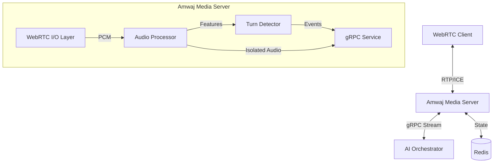

<div align="center">
  
  
  # Amwaj Media Server

  **High-Performance Real-Time Audio Streaming for AI Voice Agents**

  [](https://opensource.org/licenses/MIT)
  [](https://github.com/YASSERRMD/amwaj-media/actions)
  [](https://crates.io/crates/amwaj-media)
  [](https://hub.docker.com/r/amwaj-io/amwaj-media)

  <p align="center">
    <a href="#features">Features</a> •
    <a href="#architecture">Architecture</a> •
    <a href="#getting-started">Getting Started</a> •
    <a href="#deployment">Deployment</a> •
    <a href="#contributing">Contributing</a>
  </p>
</div>

---

## 🌊 Overview

**Amwaj** (Arabic for *waves*) is a specialized media server built in Rust, designed to handle the critical I/O layer for conversational AI agents. It bridges the gap between WebRTC clients and AI orchestrators, providing ultra-low latency audio streaming, advanced voice processing, and seamless turn-taking orchestration.

Designed for scalability and performance, Amwaj handles the "dirty work" of real-time audio—jitter buffering, packet loss concealment, VAD, and voice isolation—so your AI models can focus on intelligence.

## ✨ Features

### 🚀 Core Capabilities
- **Ultra-Low Latency Streaming**: Built on a high-performance Rust WebRTC stack with custom RTP handling.
- **Opus Codec**: Full support for Opus encoding/decoding with adaptive bitrate and Forward Error Correction (FEC).
- **gRPC Interface**: Bidirectional streaming API for easy integration with Python/Go/Node.js AI orchestrators.
- **NAT Traversal**: Built-in STUN/TURN client and ICE candidate gathering for robust connectivity.

### 🧠 Intelligent Audio Processing
- **Advanced VAD**: Energy-based and ONNX-powered Voice Activity Detection for precise end-of-speech detection.
- **Voice Isolation**: Real-time noise suppression and voice isolation using ONNX Runtime.
- **Turn-Taking Engine**: State-machine-based interruption handling (Barge-in) and silence detection.
- **Feature Extraction**: Real-time extraction of pitch, volume, and spectral features.

### 🏭 Production Ready
- **Distributed State**: Redis-backed session management for horizontal scaling.
- **Observability**: Prometheus metrics exporter and structured distributed tracing.
- **Kubernetes Native**: Ready-to-deploy Helm charts and manifests for K8s clusters.

## 🏗 Architecture



## 🚀 Getting Started

### Prerequisites
- Rust 1.75+
- Protobuf Compiler (`protoc`)
- Docker (optional)

### Installation

1.  **Clone the repository:**
    ```bash
    git clone https://github.com/YASSERRMD/amwaj-media.git
    cd amwaj-media
    ```

2.  **Download required models:**
    ```bash
    ./scripts/download_models.sh
    ```

3.  **Build and run:**
    ```bash
    cargo run --release -- --config config.toml
    ```

### Configuration

Create a `config.toml` file (see `config.toml.example`):

```toml
[server]
host = "0.0.0.0"
port = 50051

[webrtc]
ice_servers = ["stun:stun.l.google.com:19302"]

[audio]
voice_isolation_enabled = true
sample_rate = 16000

[detection]
vad_sensitivity = 0.6
```

## 📦 Deployment

### Docker

```bash
docker build -t amwaj-io/amwaj-media:latest .
docker run -p 50051:50051 -p 9090:9090 amwaj-io/amwaj-media:latest
```

### Kubernetes

Amwaj is ready for K8s. Apply the manifests in the `k8s/` directory:

```bash
kubectl apply -f k8s/
```

## 📊 Metrics & Monitoring

Amwaj exposes Prometheus metrics at `http://localhost:9090/metrics`.

**Key Metrics:**
| Metric | Description |
|--------|-------------|
| `amwaj_active_connections` | Number of active WebRTC sessions |
| `amwaj_processing_latency_ms` | Histogram of audio processing latency |
| `amwaj_turn_events_detected` | Counter of turn-taking events (Start/End) |
| `amwaj_rtp_packets_received` | Total RTP packets ingested |

## 🤝 Contributing

We welcome contributions! Please see [CONTRIBUTING.md](CONTRIBUTING.md) for details on how to get started.

## 📄 License

This project is licensed under the **MIT License**. See the [LICENSE](LICENSE) file for details.

---

<p align="center">
  Made with ❤️ by the Amwaj Team
</p>
